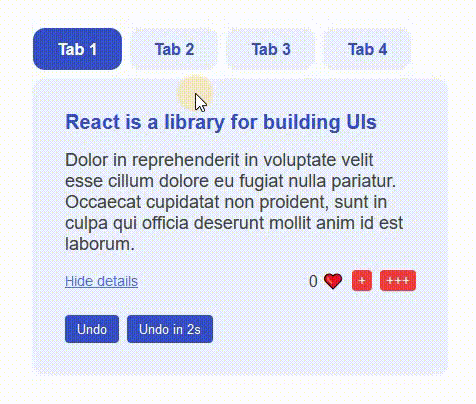

# React - tabs 

# 🔗 [Live Preview](https://main--chimerical-tanuki-ee0a44.netlify.app/)

## About 👋

This project is a simple React application that demonstrates a tabbed interface with state management. Each tab displays different content, and users can interact with the content by toggling details and liking the content. It demonstrates key React concepts like state, props, and component composition.

## Features 👨‍💻

- **Tabbed Navigation:** Switch between different tabs to view different pieces of content.
- **Dynamic Content Display:** Each tab displays a summary and detailed content.
- **State Management:** Manage and display state within the tab content, such as toggling details and counting likes.
- **Different Content Handling:** One of the tabs displays entirely different content, demonstrating state reset and component re-rendering.

## Languages

- React: functions, conditionals, useState, components.
- Styling: basic CSS